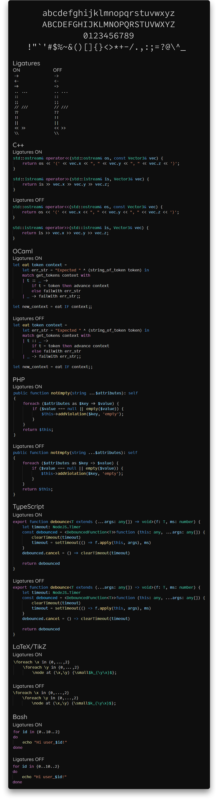

# New Code

New Code is a programming font with ligatures, based on
[Office Code Pro](https://github.com/nathco/Office-Code-Pro).
The main changes are the addition of ligatures and the redesign of some
characters.

This typeface is not meant to be customizable and the ligatures are broken in
many text editors (works fine in Visual Studio Code). If you want a
well-supported, professional-quality programming font with ligatures, you can
look at:

- [Fira Code](https://github.com/tonsky/FiraCode)
- [Hasklig](https://github.com/i-tu/Hasklig) (the most similar to New Code)
- [Monoid](https://larsenwork.com/monoid/)
- [Dank Mono](https://gumroad.com/l/dank-mono) (paid)
- [PragmataPro](https://fsd.it/shop/fonts/pragmatapro/) (paid)

## Preview

